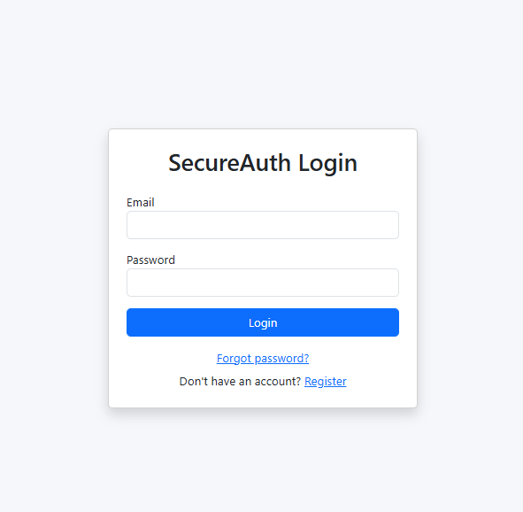
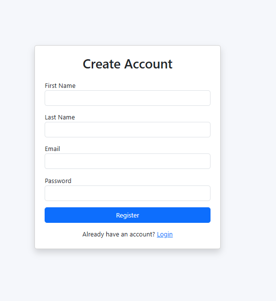
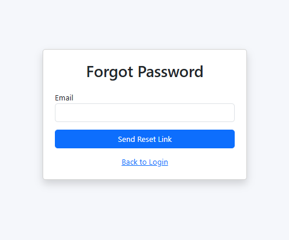
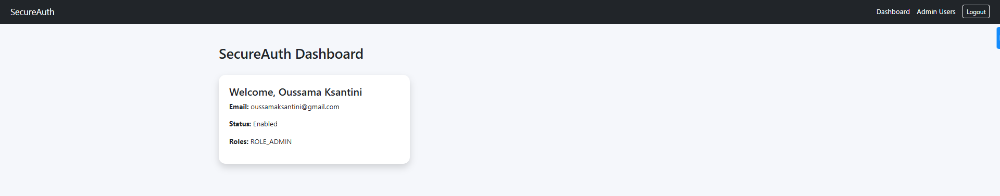

# SecureAuth Cloud

Enterprise-grade authentication and authorization platform built with Spring Boot, React, PostgreSQL, JWT, Docker, and AWS-ready architecture.

SecureAuth Cloud demonstrates real-world backend and frontend engineering practices including JWT authentication, refresh token management, email verification, password reset flows, role-based access control (RBAC), admin management, protected frontend routing, and production-ready deployment preparation.


---

# Live Demo

### Frontend

https://d2qjp6t40zpdom.cloudfront.net

### Backend API

https://api.oussamaksantini.com

### Swagger Documentation

https://api.oussamaksantini.com/swagger-ui/index.html

### Health Check

https://api.oussamaksantini.com/actuator/health

---


# Screenshots

## Login Page



---

## Register Page



---

## Forgot Password Page



## Dashboard



---


# Features

## Authentication & Security

- User Registration
- User Login
- JWT Authentication
- Refresh Tokens
- Automatic Access Token Refresh
- Email Verification
- Forgot Password
- Reset Password
- Change Password
- Logout
- BCrypt Password Encryption
- Spring Security Integration

---

## Authorization

- Role-Based Access Control (RBAC)
- USER Role
- ADMIN Role
- Protected API Endpoints
- Protected Frontend Routes
- Admin-Only Features

---

## Admin Features

- View All Users
- Enable / Disable Accounts
- Promote Users to Admin
- Remove Admin Role
- User Management Dashboard

---

## Frontend Features

- React + Vite
- Responsive UI
- Bootstrap Styling
- Protected Routes
- Admin Routes
- Axios Interceptors
- Token Refresh Handling
- Email Verification Screen
- Password Reset Screen

---

## DevOps & Cloud

- Dockerized Backend
- AWS EC2 Deployment
- AWS RDS PostgreSQL
- AWS S3 Static Website Hosting
- AWS CloudFront CDN
- HTTPS SSL Certificate
- Custom Domain Configuration
- Nginx Reverse Proxy
- GitHub Actions CI/CD
- Spring Boot Actuator Monitoring

---

# Tech Stack

## Backend

- Java 21
- Spring Boot 3
- Spring Security
- Spring Data JPA
- Hibernate
- PostgreSQL
- JWT
- Maven
- Lombok

---

## Frontend

- React
- Vite
- Axios
- React Router DOM
- Bootstrap

---

## Cloud & DevOps

- AWS EC2
- AWS RDS PostgreSQL
- AWS S3
- AWS CloudFront
- AWS Certificate Manager (ACM)
- Nginx
- Docker
- GitHub Actions

---

# System Architecture

```text
Users
   │
   ▼
CloudFront CDN
   │
   ▼
AWS S3
(React Frontend)
   │
   ▼
HTTPS API Requests
   │
   ▼
api.oussamaksantini.com
   │
   ▼
Nginx Reverse Proxy
   │
   ▼
Docker Container
(Spring Boot API)
   │
   ▼
AWS RDS PostgreSQL
```

---

# CI/CD Architecture

```text
GitHub Push
      │
      ▼
GitHub Actions
      │
      ├─────────────► Frontend
      │                 │
      │                 ▼
      │             AWS S3
      │                 │
      │                 ▼
      │            CloudFront
      │
      └─────────────► Backend
                        │
                        ▼
                    AWS EC2
                        │
                        ▼
                     Docker
```

---

# Main Functionalities

## User Registration Flow

1. User registers
2. Verification token generated
3. Verification email sent
4. User clicks verification link
5. Account activated
6. User can login

---

## Authentication Flow

1. User logs in
2. Backend generates:
   - Access Token
   - Refresh Token
3. Frontend stores tokens
4. Protected APIs require JWT
5. Expired access tokens automatically refresh

---

## Password Reset Flow

1. User requests password reset
2. Reset token generated
3. Email sent
4. User opens reset link
5. Password updated securely

---

# Project Structure

```text
secureauth-cloud/

├── secureauth-api/
│   ├── src/
│   ├── Dockerfile
│   ├── pom.xml
│   └── application.properties
│
├── secureauth-ui/
│   ├── src/
│   ├── public/
│   ├── package.json
│   └── vite.config.js
│
├── .github/
│   └── workflows/
│       ├── backend-deploy.yml
│       └── frontend-deploy.yml
│
└── README.md
```

---

# Backend Setup

## Clone Repository

```bash
git clone https://github.com/oussemakessentini/secureauth-cloud.git
```

---

## Navigate to Backend

```bash
cd secureauth-api
```

---

## Configure Environment Variables

```env
DB_URL=jdbc:postgresql://localhost:5432/secureauth_db
DB_USERNAME=postgres
DB_PASSWORD=postgres

JWT_SECRET=your-secret-key

MAIL_USERNAME=your_email@gmail.com
MAIL_PASSWORD=your_app_password

ADMIN_EMAIL=admin@secureauth.com
ADMIN_PASSWORD=Admin12345
```

---

## Build Application

```bash
mvn clean package
```

---

## Run Application

```bash
mvn spring-boot:run
```

---

# Docker Deployment

## Build Docker Image

```bash
docker build -t secureauth-api .
```

## Run Container

```bash
docker run -d \
  --name secureauth-api \
  -p 8080:8080 \
  --env-file .env \
  secureauth-api
```

---

# Frontend Setup

## Navigate to Frontend

```bash
cd secureauth-ui
```

## Install Dependencies

```bash
npm install
```

## Run Development Server

```bash
npm run dev
```

---

# Swagger Documentation

```text
https://api.oussamaksantini.com/swagger-ui/index.html
```

---

# Monitoring

## Spring Boot Actuator

Health Endpoint

```text
https://api.oussamaksantini.com/actuator/health
```

Useful Endpoints:

```text
/actuator/health
/actuator/info
/actuator/metrics
/actuator/env
```

---

# API Endpoints

## Authentication

```text
POST   /api/auth/register
POST   /api/auth/login
POST   /api/auth/logout
POST   /api/auth/refresh-token
GET    /api/auth/me
POST   /api/auth/change-password
```

---

## Email Verification

```text
GET    /api/auth/verify-email/{token}
POST   /api/auth/resend-verification
```

---

## Password Reset

```text
POST   /api/auth/forgot-password
POST   /api/auth/reset-password
```

---

## Admin Management

```text
GET     /api/admin/users
PATCH   /api/admin/users/{id}/status
PATCH   /api/admin/users/{id}/roles/add
PATCH   /api/admin/users/{id}/roles/remove
```

---

# Security Features

- JWT Authentication
- Refresh Token Rotation
- BCrypt Password Hashing
- Role-Based Authorization
- Protected API Routes
- Protected Frontend Routes
- Email Verification
- Password Reset Tokens
- CORS Configuration
- HTTPS Enforcement
- Nginx Reverse Proxy

---

# Key Achievements

- Designed and developed a full-stack authentication platform.
- Implemented JWT authentication and refresh token workflow.
- Built secure password reset and email verification functionality.
- Containerized backend using Docker.
- Deployed production infrastructure on AWS.
- Configured HTTPS with custom domain.
- Automated frontend and backend deployments using GitHub Actions.
- Integrated application health monitoring with Spring Boot Actuator.

---

# Future Improvements

- OAuth2 Login
- Google Authentication
- GitHub Authentication
- Multi-Factor Authentication (MFA)
- Redis Caching
- Rate Limiting
- Audit Logging
- User Activity Tracking
- Kubernetes Deployment
- Prometheus Monitoring
- Grafana Dashboards

---

# Author

## Oussama Ksantini

Software Engineer  
Full Stack Developer  
Cloud & DevOps Enthusiast

Portfolio:
https://oussamaksantini.com

LinkedIn:
https://www.linkedin.com/in/oussama-ksantini

GitHub:
https://github.com/oussemakessentini

---

# License

This project is intended for educational, learning, and portfolio purposes.
